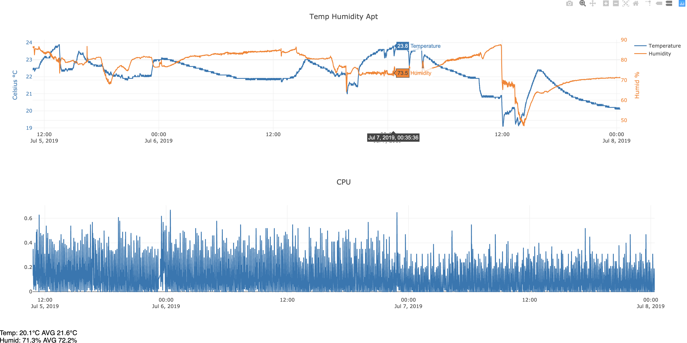

# Raspberry PI DHT Logger

Just another little project by PathToLife

Logs temperature and humidty every few seconds and runs a development server to show a pretty graph over time.

If you wish to use in production, please use a production webserver such as ngix and add caching.

# Setup

python 3.5, will probably work with 3.7 but  most raspberry pi's will be running 3.5

Pip install the required packages, most notable ones are listed below but you may need to install others,
check temp.log for errors upon starting:
- apscheduler
- Adafruit_SSD1306
- PIL
- Adafruit_DHT

# Run

>./start.sh

>./stop.sh

>./restart.sh

> http://serverIP:81
